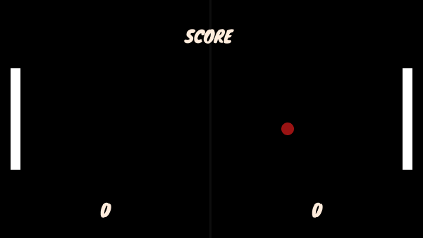

# Pong Game

I've done development using turtle before, I recently started learning pygame, normally I don't like game coding because it takes a lot of time, but recently I started to make modern interface designs for my projects over figma in the same way, I thought why not update this project, I thought it would be a nice project for me to adapt it to pygame.

_There is a section from the game at the bottom_

**You play with arrow keys and ws and I added a sound**
